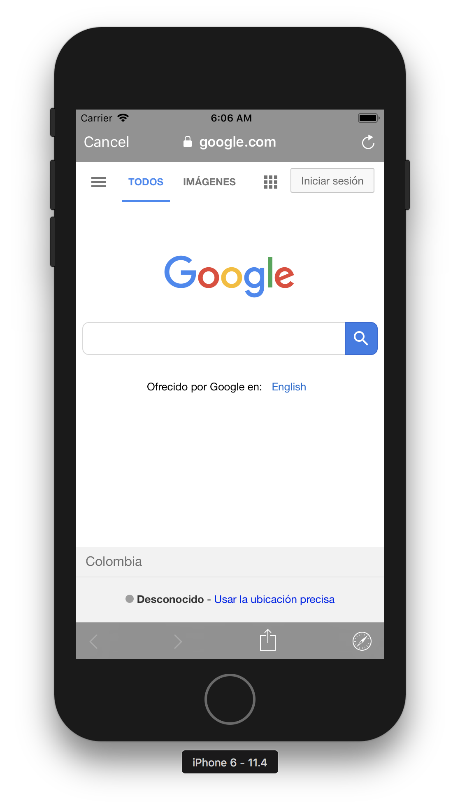

<p align="center">
  <h1 align="center">InAppBrowser for React Native</h1>
</p>

<p align="center">
  
</p>

## Getting started

`$ npm install react-native-inappbrowser-reborn --save`

### Mostly automatic installation

`$ react-native link react-native-inappbrowser-reborn`

### Manual installation


#### iOS

1. In XCode, in the project navigator, right click `Libraries` ➜ `Add Files to [your project's name]`
2. Go to `node_modules` ➜ `react-native-inappbrowser-reborn` and add `RNInAppBrowser.xcodeproj`
3. In XCode, in the project navigator, select your project. Add `libRNInAppBrowser.a` to your project's `Build Phases` ➜ `Link Binary With Libraries`
4. Run your project (`Cmd+R`)<

#### iOS with Podfile
1. Open up `ios/Podfile`
  - Add `pod 'RNInAppBrowser', :path => '../node_modules/react-native-inappbrowser-reborn'`
2. Run `pod install`

#### Android

1. Open up `android/app/src/main/java/[...]/MainApplication.java`
  - Add `import com.proyecto26.inappbrowser.RNInAppBrowserPackage;` to the imports at the top of the file
  - Add `new RNInAppBrowserPackage()` to the list returned by the `getPackages()` method
2. Append the following lines to `android/settings.gradle`:
  	```
  	include ':react-native-inappbrowser-reborn'
  	project(':react-native-inappbrowser-reborn').projectDir = new File(rootProject.projectDir, 	'../node_modules/react-native-inappbrowser-reborn/android')
  	```
3. Insert the following lines inside the dependencies block in `android/app/build.gradle`:
  	```
      implementation project(':react-native-inappbrowser-reborn')
  	```

## Usage

Methods       | Action
------------- | ------
`open`        | Opens the url with Safari in a modal on iOS using **SFSafariViewController**, and Chrome in a new custom tab on Android. On iOS, the modal Safari will not share cookies with the system Safari.
`close`       | Dismisses the system's presented web browser
`openAuth`    | Opens the url with Safari in a modal on iOS using **SFAuthenticationSession**, and Chrome in a new custom tab on Android. On iOS, the user will be asked whether to allow the app to authenticate using the given url.
`closeAuth`   | Dismisses the current authentication session
`isAvailable` | Detect if the device supports this plugin

### Demo

```javascript
import InAppBrowser from 'react-native-inappbrowser-reborn';

...
  async openLink() {
    try {
      await InAppBrowser.isAvailable()
      const result = await InAppBrowser.open('https://www.google.com', {
        // iOS Properties
        dismissButtonStyle: 'cancel',
        preferredBarTintColor: 'gray',
        preferredControlTintColor: 'white',
        readerMode: false,
        // Android Properties
        showTitle: true,
        toolbarColor: '#6200EE',
        secondaryToolbarColor: 'black',
        enableUrlBarHiding: true,
        enableDefaultShare: true,
        forceCloseOnRedirection: false,
        // Specify full animation resource identifier(package:anim/name)
        // or only resource name(in case of animation bundled with app).
        animations: {
          startEnter: 'slide_in_right',
          startExit: 'slide_out_left',
          endEnter: 'slide_in_right',
          endExit: 'slide_out_left',
        },
        headers: {
          'my-custom-header': 'my custom header value'
        },
      });
      Alert.alert(JSON.stringify(result));
    } catch (error) {
      Alert.alert(error.message)
    }
  }
...
```

### Authentication Flow using Deep Linking

- utilities.js
```javascript
import { Platform } from 'react-native'
export const getDeepLink = (path = "") => {
  const scheme = 'my-scheme'
  const prefix = Platform.OS == 'android' ? `${scheme}://my-host/` : `${scheme}://`
  return prefix + path
}
```
- App.js ([Using react-navigation with Deep Linking](https://reactnavigation.org/docs/en/deep-linking.html))
```javascript
import { Root } from 'native-base'
import { getDeepLink } from './utilities'
import { createStackNavigator } from 'react-navigation'

const Main = createStackNavigator(
  {
    LoginComponent: { screen: LoginComponent },
    HomeComponent: { screen: HomeComponent },
    SplashComponent: { //Redirect users to the Home page if they are authenticated, otherwise to Login page...
      screen: SplashComponent,
      path: 'callback/' //Deep linking to get the auth_token
    }
  },
  {
    index: 0,
    initialRouteName: 'SplashComponent',
    headerMode: 'none'
  }
)
...
  render() {
    return (
      <Root>
        <Main uriPrefix={getDeepLink()} />
      </Root>
    )
  }
...
```

- LoginComponent
```javascript
import { Linking } from 'react-native'
import InAppBrowser from 'react-native-inappbrowser-reborn'
import { getDeepLink } from './utilities'
...
  async onLogin() {
    const deepLink = getDeepLink("callback")
    const url = `https://my-auth-login-page.com?redirect_uri=${deepLink}`
    try {
      await InAppBrowser.isAvailable()
      InAppBrowser.openAuth(url, deepLink, {
        // iOS Properties
        dismissButtonStyle: 'cancel',
        // Android Properties
        showTitle: false,
        enableUrlBarHiding: true,
        enableDefaultShare: true,
      }).then((response) => {
        if (response.type === 'success' &&
          response.url) {
          Linking.openURL(response.url)
        }
      })
    } catch (error) {
      Linking.openURL(url)
    }
  }
...
```

- SplashComponent
```javascript
...
  componentWillMount() {
    const { navigation } = this.props
    const { state: { params } } = navigation
    const { access_token } = params || {}

    if (access_token) {
      // Opened by deep linking, the user is authenticated
      // Redirect to the Home page
    }
    else {
      // Detect if the stored token is still valid
      // And redirect the user to Home or Login page
    }
  }
...
```

### StatusBar

The StatusBar will keep the last one provided in your app. So if the StatusBar is `dark-content` before you open the browser this will keep it. If you want to change before opening you can do something like

```javascript
  async openInBrowser(url) {
    try {
      StatusBar.setBarStyle('dark-content')
      await InAppBrowser.open(url)
    } catch (error) {
      Alert.alert(error.message);
    }
  })
```

If you need to restore the old bar style, after the browser is dismissed, you can try and patch the StatusBar.setBarStyle function to store the old value like so:

```js
// patch StatusBar.setBarStyle to make style accessible
const _setBarStyle = StatusBar.setBarStyle;
StatusBar.setBarStyle = (style) => {
	StatusBar.currentStyle = style;
	_setBarStyle(style);
};
```

You can than restore the old bar style after the browser has been dismissed like this: 

```javascript
  async openInBrowser(url) {
    try {
      const oldStyle = StatusBar.currentStyle
      StatusBar.setBarStyle('dark-content')
      await InAppBrowser.open(url)
      if(oldStyle) StatusBar.setBarStyle(oldStyle)
    } catch (error) {
      Alert.alert(error.message);
    }
  })
```

## Credits 👍
* **Expo:** [WebBrowser](https://docs.expo.io/versions/latest/sdk/webbrowser)
* **React Native Custom Tabs:** [Chrome Custom Tabs for React Native](https://github.com/droibit/react-native-custom-tabs)
* **React Native Safari View:** [A React Native wrapper for Safari View Controller](https://github.com/naoufal/react-native-safari-view)

## Contributors ✨
Thanks goes to these wonderful people:
<!-- CONTRIBUTORS-LIST:START - Do not remove or modify this section -->
| [<br /><sub><b>Juan Nicholls</b></sub>](https://github.com/jdnichollsc)<br />[✉](mailto:jdnichollsc@hotmail.com) | [<br /><sub><b>Emanuel Quimper</b></sub>](https://github.com/EQuimper)<br />[✉](mailto:quimperemanuel@gmail.com) | [<br /><sub><b>Jonathan Bones</b></sub>](https://github.com/bonesyblue)<br />[✉](mailto:bonesyblue@gmail.com) | [<br /><sub><b>Mihai Lazari</b></sub>](https://github.com/mlazari) | [<br /><sub><b>Kalle Haavisto</b></sub>](https://github.com/maestor)<br />[✉](mailto:maestori@gmail.com) | [<br /><sub><b>Worapot Pengsuk</b></sub>](https://github.com/plamworapot) | [<br /><sub><b>Adam McArthur</b></sub>](https://github.com/adammcarth)<br />[✉](mailto:adam@adammcarthur.net) |
| :---: | :---: |:---: | :---: | :---: | :---: | :---: |
| [<br /><sub><b>Artem Emelyanov</b></sub>](https://github.com/SnaiNeR)<br />[✉](mailto:snainer@gmail.com) | [<br /><sub><b>Robert Scott</b></sub>](https://github.com/rbscott) |
<!-- CONTRIBUTORS-LIST:END -->

## Supporting 🍻
I believe in Unicorns 🦄
Support [me](http://www.paypal.me/jdnichollsc/2), if you do too.

## Happy coding 💯
Made with ❤️


